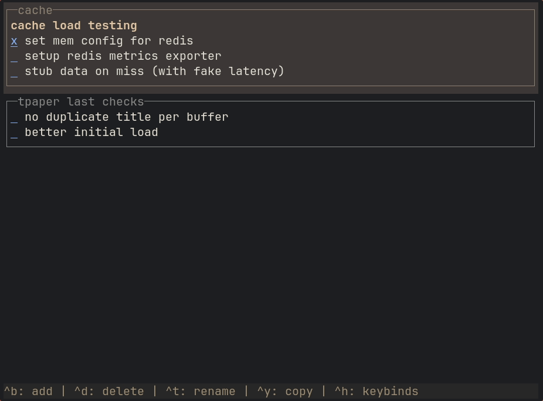

# tpaper

A terminal-based note-taking app built around the idea of **buffers** and **blocks** — think of it as a lightweight, keyboard-driven notebook that lives entirely in your terminal.

Yes its a [heynote](https://github.com/heyman/heynote) rip-off for the terminal with less features.




## Concepts

- **Buffer** — a named collection of blocks, stored as a Markdown file on disk. Roughly analogous to a notebook or a tab.
- **Block** — an individual note within a buffer, written in Markdown and rendered with syntax highlighting in the terminal.

## Installation

```bash
brew install yagnikpt/tap/tpaper
```

```bash
bun install -g @yagnikpt/tpaper
```

## Keybindings & Features
* `ctrl+h` — opens the keymaps menu

### Editing
* `i` — Edit the block inline using the built-in editor
* `ctrl+i` — Edit the block using your external system editor (configured via `$EDITOR`, defaults to `nano`)
* `enter` — Edit block (opens the built-in inline editor by default, or your system editor if configured)

## Configuration

Run `tpaper --help` to see the necessary flags and options.

The configuration file is located at `~/.config/tpaper-cli/config.yaml` (Linux example).

You can customize the following settings:

```yaml
# ~/.config/tpaper-cli/config.yaml

# If true, pressing enter/return on a block opens it in your external system editor by default.
systemEditorByDefault: false
```

## Data storage

Everything is stored locally. The exact paths depend on your OS.

| Kind | Path (Linux example) |
|---|---|
| Buffers | `~/.local/share/tpaper-cli/` |
| Config | `~/.config/tpaper-cli/config.yaml` |

Buffers are plain Markdown files. Blocks are delimited by HTML comments so the files remain human-readable outside the app.

## Development

```bash
bun install
bun dev        # run with file watching
```

## Building

```bash
bun run build
```

Builds for all supported platforms (linux-x64, darwin-arm64, linux-arm64, windows-x64, darwin-x64).

## Stack

- [OpenTUI](https://opentui.com) — terminal UI framework
- [Solid.js](https://solidjs.com) — reactive UI layer
- [Bun](https://bun.sh) — runtime and bundler
- [js-yaml](https://github.com/nodeca/js-yaml) — config serialization
